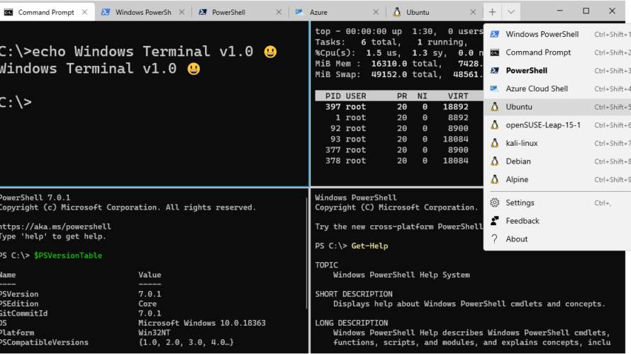

## WSL (Ubuntu) のインストール方法

1.  **ターミナルを管理者として起動**
    スタートボタンを右クリックし、「ターミナル (管理者)」を選択して起動してください。

2.  **Windows の機能を確認・有効化**
    * 検索バーに「Windows」と入力します。
    * 検索結果に表示される「Windows の機能の有効化または無効化」を開きます。
    * 以下の項目にチェックを入れます。
        * **Linux 用 Windows サブシステム**
        * **仮想マシンプラットフォーム**
    * チェック後、「OK」をクリックし、システムの再起動を行ってください。

3.  **WSL をアップデート**
    ターミナルを開き、以下のコマンドを実行します。
    ```powershell
    wsl --update
    ```

4.  **Ubuntu のインストール**
    ターミナルを開き、以下のコマンドを実行します。デフォルトで Ubuntu がインストールされます。
    ```powershell
    wsl --install
    ```
    インストール完了後、必要に応じてシステムを再起動してください。

5.  **WSL (Ubuntu) を起動**
    ターミナルのタブ横にある「新しいタブ」ボタン (+) の横にあるボタンをクリックし、表示される一覧から「Ubuntu」を選択して起動してください。

    

6.  **初期設定**
    Ubuntu の初回起動時には、新しいユーザー名とパスワードの設定が求められます。画面の指示に従って設定を行ってください。

**完了！**
